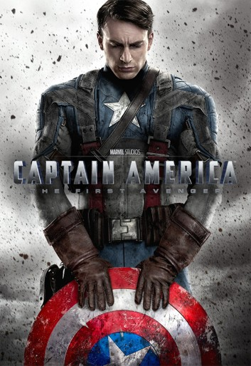

# SaveTheEarth
task 0

# *CAPTAIN AMERICA*

## TABLE OF CONTENTS

* INTRODUCTION
* BIOMETRICS
* HISTORY
* WEAPONS
* STRENGTHS
* LIMITATIONS
* IMAGE

### *INTRODUCTION*

REAL NAME: Steve Rogers
OCCUPATION: crimefighter, (former) freelance artist
LEGAL STATUS: Citizen of the United States with no criminal record
IDENTITY: Publicly known
OTHER ALIASES: Nomad, the Captain
PLACE OF BIRTH: New York City
MARITAL STATUS: Single
KNOWN RELATIVES: Joseph (father, deceased), Sara (mother, deceased)
GROUP AFFILIATION: Former member of the Invaders, former partner to Bucky, the Falcon, and Nomad, current member of the Avengers
BASE OF OPERATION: New York City

### *BIOMETRICS*

HEIGHT: 6 ft. 2 in.
WEIGHT: 240 lbs.
EYES: Blue
HAIR: Blond

### *HISTORY*

Steve Rogers was born during the Depression and grew up a frail youth in a poor family. His father died when he was a child, his mother when he was in his late teens. Horrified by newsreel footage of the Nazis in Europe, Rogers was inspired to try to enlist in the Army. However, because of his frailty and sickness, he was rejected. Overhearing the boy's earnest plea to be accepted, General Chester Phillips of the U.S. Army offered Rogers the opportunity to take part in a special experiment called Operation: Rebirth. Rogers agreed and was taken to a secret laboratory in Washington, D.C. where he was introduced to Dr. Abrahan Erskine (code named: Prof. Reinstein), the creator to the Super-Soldier formula.

After weeks of tests, Rogers was at last administered the Super-Soldier serum. Given part of the compound intravenously and another part orally, Rogers was then bombarded by "vita-rays," a special combination of exotic (in 1941) wavelengths of radiation designed to accelerate and stabilize the serum's effect on his body. Steve Rogers emerged from the vita-ray chamber with a body as perfect as a body can be and still be human. A Nazi spy who observed the experiment murdered Dr. Erskine mere minutes after its conclusion. Erskine died without fully committing the Super-Soldier formula to paper, leaving Steve Rogers the Sole beneficiary of his genius.

Roger was then put through an intensive physical and tactical training program,teaching him gymnastics, hand-to-hand combat and military strategy. Three months later, he was given his first assignment, to stop the Nazi agent called the Red Skull. To help him become a symbolic counterpart to the Red Skull, Rogers was given the red, white, and blue costume of Captain America.

During the war, he served as both a symbol of freedom and America's most effective special operative. Then, during the final days of the war, he was trying to stop a bomb-loaded drone-plane launched by Nazi technician Baron Heinrich Zemo when the plane exploded, killing his partner Bucky; and throwing him unhurt into icy Arctic waters. The Super-Soldier formula prevented crystallization of Captain America's bodily fluid, allowing him to enter a state of suspended animation. Decades later, he was rescued by the newly-formed Avengers and became a cornerstone of the team. His might undiminished. Captain America remains a symbol of liberty and justice.

### *WEAPONS*

Captain America's **only weapon is his shield**, a concave disk 2.5 feet in diameter, weighing 12 pounds. It is made of a unique **Vibranium-Adimantium alloy** that has never been duplicated. The Shield was cast by American metallurgist Dr. Myron MacLain, who was contracted by the U.S. government to create an impenetrable substance to use for tanks during World War II. During his experiments, MacLain combined Vibranium with an Adamantium-steel alloy he was working with and created the disc-shaped shield. MacLain was never able to duplicate the process due to his inability identify a still unknown factor that played a role in it. The shield was awarded to Captain America by the government several months after the beginning of his career.

The shield has **great aerodynamic properties**: it is able to slice through the air with minimal wind resistance and deflection of path. Its great overall resilience, combined with its natural concentric stiffness, enables it to rebound from objects with minimal loss of angular momentum. It is virtually indestructible: it is resistant to penetration, temperature extremes, and the entire electromagnetic spectrum of radiation. The *only way it can be damaged in any way is by tampering with its molecular bonding*.

### *STRENGTHS*

 Captain America has agility, strength, speed, endurance, and reaction time superior to any Olympic athlete who ever competed. The **Super-Soldier** formula that he has metabolized has enhanced all of his bodily functions to the peak of human efficiency. Notably, his body eliminates the excessive build-up of fatigue-producing poisons in his muscles, granting him phenomenal endurance.

Captain America has mastered the **martial art of American-style boxing and judo**, and has combined these disciplines with his own **8unique hand-to-hand style of combat**. He engages in a daily regimen of rigorous exercise (including aerobics, weight lifting, gymnastics, and simulated combat) to keep himself in peek condition. Captain America is one of the finest human combatants Earth has ever known.

STRENGTH LEVEL: Captain America represents the pinnacle of human physical perfection. While not superhuman, he is as strong as a human being can be. He can lift (press) a maximum of 800 pounds with supreme effort.

### *LIMITATIONS*

Captain America is subject to **all human vulnerabilities**, although his immunity to diseases is extraordinary.

### *IMAGE*

